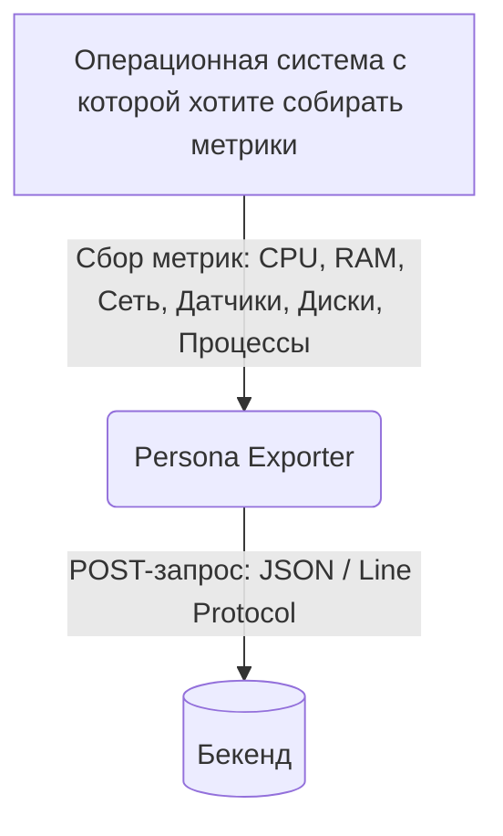
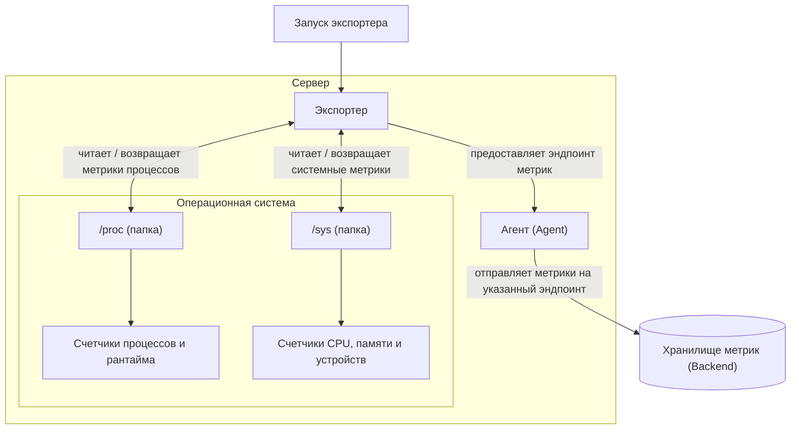

# Введение
## Архитектура потока данных

Процесс и логику работы **Persona Exporter** *(или же любого другого экспортера метрик)*
можно описать следующими схемами:

Или же более подробно. Схема хоть и описывает сбор **Linux** системах, но передает сам механизм сбора
который не зависит от платформы:

---

## С чего начать?

Если вы хотите развернуть экспортер прямо сейчас, переходите к следующему разделу **Установка**, 
где описаны способы сборки из исходников и особенности настройки 
под разные операционные системы.

