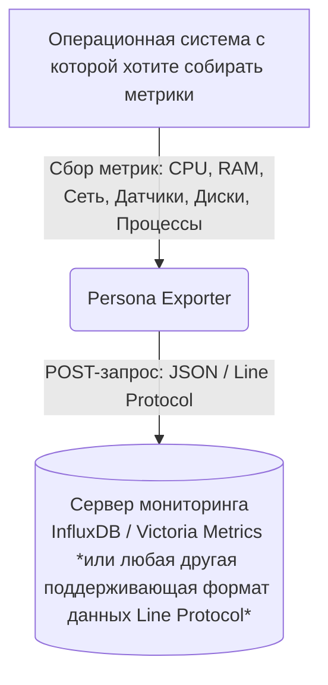

# Введение
## Архитектура потока данных

Процесс работы Persona Exporter можно верхнеуровнево описать следующей схемой:

---

## С чего начать?

Если вы хотите развернуть экспортер прямо сейчас, переходите к разделу [Установка](../2_install/README.md), 
где описаны способы сборки из исходников, запуск в Docker и особенности настройки 
под разные операционные системы.

